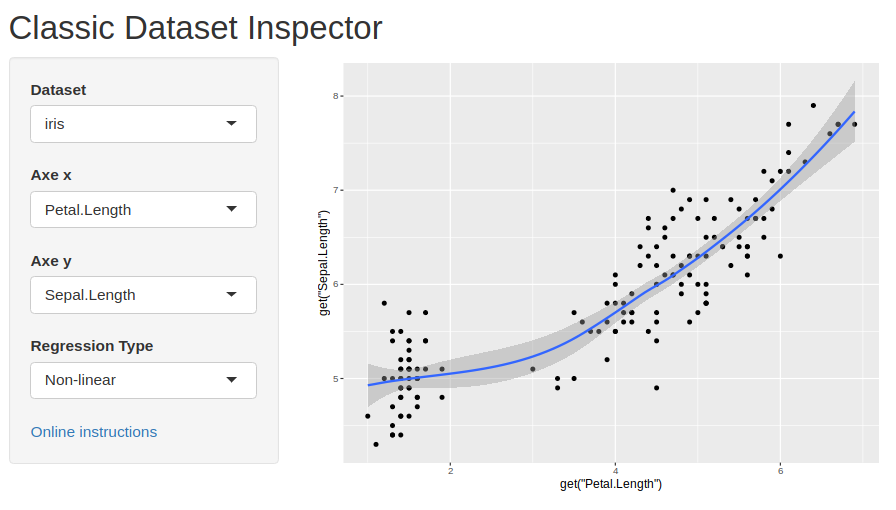
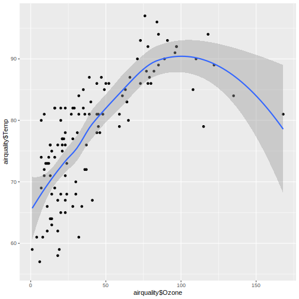

Data Product Homework : An Interactive Data Viewer
========================================================
author: 
date: December 4th, 2021
autosize: true


Presentation
========================================================
The shiny application presented here is an interactive graphic interface that allows the user to browse through some of the "classic" datasets seen during the course through a two dimensional plot. A regression analysis is displayed as well. This small work is done as a requirement for the week4's assignment of the data product course of JHSPH's data science specialisation. This presentation is made with R presentation. As this homework is more of an interface that tries to make good use of Shiny's interactive features than a statistical method there is not much point to present code outside of the shiny application. But as it is mandatory, there is an example of an output returned by the application that shows code being run within this html5 slide deck.


Options
========================================================

***
- the user must choose a dataset from the drop-down menu.  
- the user must choose which variables to be displayed on the x-y axis.  
- the user can choose between two regression method to be displayed, linear or non-linear.  
- it is easy to modify the application to change the collection of dataset.  

Code
========================================================


```r
library(ggplot2)
ggplot(airquality, aes(x=airquality$Ozone ,y=airquality$Temp) ) + 
                geom_point() +  
                geom_smooth(method="loess")
```



Links
========================================================  

[Link to the shinyapp server](https://tapewormer.shinyapps.io/data_inspector/)  

[The Github repository for the application](https://github.com/Tapewormer/Data_Product_Week4)  

[Documentation for package ‘datasets’](https://stat.ethz.ch/R-manual/R-devel/library/datasets/html/00Index.html)

[R Presentations](https://support.rstudio.com/hc/en-us/articles/200486468)

[Shiny at Rstudio](https://shiny.rstudio.com/)


